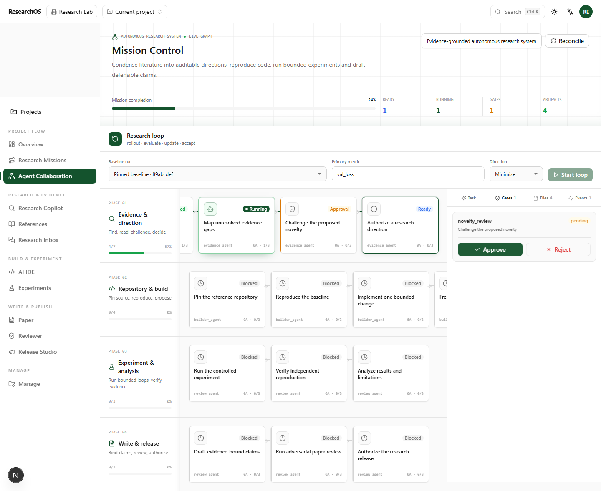
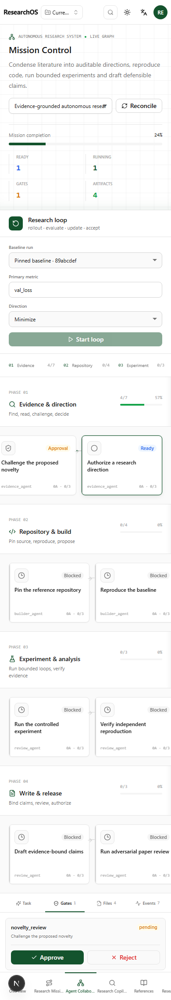
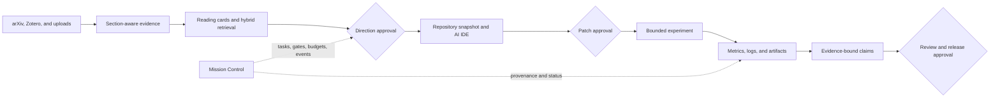

<div align="center">

# ResearchOS

**An evidence-grounded operating system for AI-assisted research.**

Read literature, choose a direction, reproduce code, run bounded experiments, and draft defensible claims in one auditable workspace.

[中文说明](README_zh.md) · [Architecture](docs/ARCHITECTURE.md) · [Agent protocol](docs/AGENT_PROTOCOL_ZH.md) · [Runbook](docs/RUNBOOK.md)

[](https://github.com/Chenxxxxxx06/researchos/actions/workflows/ci.yml)


[](LICENSE)

</div>

<p align="center">
  
</p>

<p align="center"><sub>Mission Control, captured from the deterministic Playwright acceptance scenario: a persistent research DAG, approval gates, artifacts, events, and bounded research-loop controls.</sub></p>

> ResearchOS is in alpha. Its core project, literature, agent, IDE, and mission workflows are real and persisted. Unattended failure recovery and isolated experiment execution are the next reliability milestones.

## What works today

`Available` means the UI, API, persistence, and primary tests are connected. `Bounded` means the implementation is real but deliberately restricted. `Scaffold` means state and workflow exist, while part of execution is still manual or mocked.

| Capability | Current implementation | Maturity |
|---|---|---|
| Mission Control | Persistent task DAG, dependencies, approval gates, worker leases, events, artifacts, and budgeted research-loop iterations | Available |
| Literature and evidence | arXiv and Zotero intake, ar5iv/native HTML sections, hybrid retrieval, structured reading cards for methods, experiments, results, limitations, and conclusions | Available |
| LLM connections | Create, edit, test, disable, and delete OpenAI-compatible or Anthropic configurations; encrypted keys and per-run model selection | Available |
| Research Copilot | Project-scoped chat, source-backed context, innovation extraction, ideas, reviews, and Agent Run events | Available |
| AI IDE and runtimes | Workspace tree, Monaco editing, reviewable patches, repository import, restricted local argv execution, host-key-verified SSH/SFTP, and audit records | Bounded |
| Experiments | Experiment plans, run records, NDJSON logs and metrics, comparisons, figures, and bounded loop evaluation | Scaffold |
| Paper and review | LaTeX workspace, suggestions, evidence-aware review flows, reviewer rubrics, and release checks | Scaffold |
| Realtime UX | Shared WebSocket connection, heartbeat, reconnect backoff, event deduplication, and REST replay reconciliation | Available |

<details>
<summary>Responsive Mission Control preview</summary>

<p align="center">
  
</p>

</details>

## Research path

ResearchOS treats research as a traceable chain rather than a collection of disconnected chats.



The intended invariant is simple: every consequential claim should be traceable to source evidence, a repository state, an approved change, and an experiment result.

## Model connections

Model configuration is editable after creation. Project administrators can change the display name, provider type, base URL, model, API key, active state, and description. Leaving the API key blank during an edit preserves the encrypted secret. The connection test performs a small real generation and reports latency, token usage, and the provider response.

Two gaps remain: a successful connection test is not yet stored as durable health state, and a queued Agent Run resolves the current mutable model configuration when the worker starts. Immutable execution receipts are therefore a priority for reproducible runs.

## Quick start

Requirements: Docker, Node.js 22+, Corepack, and Git.

```bash
corepack enable
pnpm install --frozen-lockfile
pnpm stack:full
```

Open [http://localhost:3000/login](http://localhost:3000/login) and use:

| Demo account | Value |
|---|---|
| Email | `demo@researchos.dev` |
| Password | `demo-password-123` |

For a prepared Windows development checkout, the faster local launcher keeps infrastructure in Docker and runs the API, worker, and web app from the current source tree:

```powershell
pnpm site:up
pnpm site:verify
pnpm site:status
pnpm site:logs
pnpm site:down
```

See [Site deployment](docs/SITE_DEPLOYMENT_ZH.md) for prerequisites and troubleshooting.

## Architecture

| Layer | Technology | Responsibility |
|---|---|---|
| `apps/web` | Next.js 15, React 19, TanStack Query, Monaco, Recharts | Project workspaces and realtime interaction |
| `apps/api` | FastAPI, SQLAlchemy, PostgreSQL/pgvector | Domain services, authorization, provenance, and APIs |
| `apps/worker` | Celery and Redis | Agent execution, ingestion, and figure workloads |
| Runtime | Restricted local processes and AsyncSSH | Audited code and remote workspace operations |
| Storage | PostgreSQL, Redis, MinIO | Durable state, coordination, and artifacts |

The multi-agent design is role-based: coordinator, evidence, builder, experiment, reviewer, and writer responsibilities communicate through persisted tasks, explicit schemas, approval gates, artifacts, and events. See [Agent Army Architecture](docs/AGENT_ARMY_ARCHITECTURE_ZH.md) and [Agent Protocol](docs/AGENT_PROTOCOL_ZH.md).

## Known boundaries and next priorities

| Priority | Gap | Why it matters |
|---|---|---|
| P0 | Dispatch outbox/reconciler and Agent Run heartbeat recovery | A broker or worker failure can leave a queued or running job stranded |
| P0 | Independent coordinator scheduler | Unattended recovery and simultaneous-parent reconciliation still depend on an explicit coordinator tick |
| P0 | Immutable execution receipt | Model, prompt, skill, tool policy, and input revisions must be fixed when a run is created |
| P0 | Isolated experiment runner | Commands are recorded and telemetry can be ingested, but the worker does not yet execute experiment jobs |
| P0 | Cross-domain provenance and claim registry | Paper quotes, code, commits, metrics, and manuscript claims need one enforced graph |
| P1 | Fully automated research loop | Iterations and keep/discard decisions exist, but patch creation and experiment execution are not yet chained automatically |
| P2 | Scientific document fidelity | PDF OCR, page/coordinate anchors, figures, tables, equations, and citation graphs remain incomplete |
| P2 | Durable model health | Active configuration should be distinct from last verified connection status |

Development fallbacks are explicit: the no-key LLM path uses a deterministic mock provider; LaTeX compilation is not yet an isolated `latexmk` service; uploaded audio transcription requires an active ASR-compatible model configuration, while diarization and object-storage integration remain incomplete.

## Verification

| Command | Scope |
|---|---|
| `pnpm check` | Backend tests plus frontend typecheck and production build |
| `pnpm check:api:test` | Backend PostgreSQL/Redis test suite |
| `pnpm check:web` | Workspace typecheck and Next.js build |
| `pnpm smoke:api` | Core API smoke path |
| `pnpm smoke:e2e` | Playwright workspace flows |

## Documentation

| Document | Purpose |
|---|---|
| [Architecture](docs/ARCHITECTURE.md) | System boundaries and services |
| [Experiment system](docs/EXPERIMENT_SYSTEM.md) | Experiment records, metrics, and lifecycle |
| [SSH runtime](docs/SSH_RUNTIME.md) | Remote execution policy and audit model |
| [Skills system](docs/SKILLS_SYSTEM.md) | Skill manifests, activation, and runtime injection |
| [Runbook](docs/RUNBOOK.md) | Operations and troubleshooting |
| [API reference](docs/API.md) | REST and WebSocket surface |

## Contributing

ResearchOS needs careful work across agent reliability, scientific document processing, experiment isolation, frontend workflows, and evaluation. Open an issue before a large change, keep changes scoped, and include tests for the behavior you alter.

Contact: [3653448612@qq.com](mailto:3653448612@qq.com)

Copyright 2024-2026 Chenxxxxxx06. All rights reserved. See [LICENSE](LICENSE).
