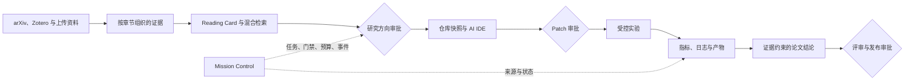

<div align="center">

# ResearchOS

**以证据为基础的 AI 科研操作系统。**

在一个可审计工作台中完成论文阅读、方向决策、代码复现、受控实验与可辩护论文结论。

[English](README.md) · [系统架构](docs/ARCHITECTURE.md) · [Agent 协议](docs/AGENT_PROTOCOL_ZH.md) · [运行手册](docs/RUNBOOK.md)

[](https://github.com/Chenxxxxxx06/researchos/actions/workflows/ci.yml)


[](LICENSE)

</div>

<p align="center">
  
</p>

<p align="center"><sub>截图来自确定性的 Playwright 验收场景，展示持久化科研任务 DAG、审批门禁、产物、事件与有边界的 Research Loop。</sub></p>

> ResearchOS 目前处于 alpha 阶段。项目、文献、Agent、AI IDE 和 Mission 的核心链路已经真实落库并连通；无人值守故障恢复与隔离实验执行是下一阶段最重要的可靠性目标。

## 当前可用能力

`可用` 表示 UI、API、持久化与主要测试已经连通；`受限可用` 表示实现是真实的，但受安全策略明确限制；`可用骨架` 表示状态和工作流已建立，其中一部分执行仍需人工完成或使用 Mock。

| 能力 | 当前实现 | 成熟度 |
|---|---|---|
| Mission Control | 持久化任务 DAG、依赖关系、审批门禁、Worker Lease、事件、产物与受预算约束的 Research Loop 迭代 | 可用 |
| 文献与证据 | arXiv、Zotero、ar5iv/native HTML 分节、混合检索，以及覆盖方法、实验、结果、局限和结论的 Reading Card | 可用 |
| 模型连接 | OpenAI-compatible 与 Anthropic 配置的新增、编辑、连接测试、停用和删除；密钥加密保存，可按 Run 选模型 | 可用 |
| Research Copilot | 项目级对话、基于来源的上下文、创新点提取、Idea、评审与 Agent Run 事件 | 可用 |
| AI IDE 与运行时 | 工作区文件树、Monaco 编辑、可审查 Patch、仓库导入、受限本地 argv、校验 host key 的 SSH/SFTP 与审计记录 | 受限可用 |
| 实验系统 | 实验方案、Run 记录、NDJSON 日志和指标、对比、图表与受控迭代评估 | 可用骨架 |
| 论文与评审 | LaTeX 工作台、900ms 防抖保存、受限 latexmk 实时 PDF、编译缓存、写作建议与结构化评审 | 受限可用 |
| 成果发布 | qwen-plus README 补丁；AutoDesign 网页、Poster、Slides 的后台生成、历史、预览与下载 | 受限可用 |
| 实时体验 | WebSocket 共享连接、心跳、指数重连、事件去重与 REST replay 对账 | 可用 |

<details>
<summary>查看移动端 Mission Control</summary>

<p align="center">
  
</p>

</details>

## 端到端科研链路

ResearchOS 把科研建模为一条可追踪链路，而不是一组相互割裂的聊天窗口。



平台最终要维持一个硬约束：每一条重要结论都能追溯到原始论文证据、确定的仓库状态、经过批准的代码变更与真实实验结果。

## 模型接口

模型配置创建后可以继续编辑。项目管理员可以修改名称、提供商类型、Base URL、模型、API Key、启用状态和描述；编辑时 API Key 留空会保留已有加密密钥。连接测试会执行一次很小的真实生成，并返回延迟、Token 用量与模型响应。

这里仍有两个缺口：成功测试尚未保存为持久化健康状态；排队中的 Agent Run 会在 Worker 启动时读取当时最新的可变模型配置。因此，下一步需要为每次运行固定不可变的 Execution Receipt，确保模型和上下文可复现。

## 快速启动

需要 Docker、Node.js 22+、Corepack 与 Git。

```bash
corepack enable
pnpm install --frozen-lockfile
pnpm stack:full
```

打开 [http://localhost:3000/login](http://localhost:3000/login)，使用演示账号登录：

| 演示账号 | 内容 |
|---|---|
| 邮箱 | `demo@researchos.dev` |
| 密码 | `demo-password-123` |

对于已经准备好本地 Python 与前端依赖的 Windows 开发环境，可以让基础设施运行在 Docker 中，而 API、Worker 和 Web 直接使用当前源代码：

```powershell
pnpm site:up
pnpm site:verify
pnpm site:status
pnpm site:logs
pnpm site:down
```

环境要求与故障排查见 [本地站点部署说明](docs/SITE_DEPLOYMENT_ZH.md)。

## 系统架构

| 层级 | 技术 | 责任 |
|---|---|---|
| `apps/web` | Next.js 15、React 19、TanStack Query、Monaco、Recharts | 项目工作台与实时交互 |
| `apps/api` | FastAPI、SQLAlchemy、PostgreSQL/pgvector | 领域服务、权限、来源追踪与 API |
| `apps/worker` | Celery、Redis | Agent 执行、文献解析与图表任务 |
| Runtime | 受限本地进程、AsyncSSH | 可审计的代码与远程工作区操作 |
| Storage | PostgreSQL、Redis、MinIO | 持久化状态、协调与产物 |

多 Agent 架构按照 Coordinator、Evidence、Builder、Experiment、Reviewer、Writer 等角色划分职责，通过持久化任务、明确 Schema、审批门禁、产物和事件通信。当前 17 节点 Mission DAG、单次 Runtime 和 RAG 的实际调用位置见 [Agent 链路与 RAG](docs/AGENT_CHAIN_AND_RAG_ZH.md)。成果设计通过独立的 [AutoDesign 集成](docs/AUTODESIGN_INTEGRATION_ZH.md) 运行。

## 当前问题与优化优先级

| 优先级 | 问题 | 影响 |
|---|---|---|
| P0 | Dispatch Outbox/Reconciler 与 Agent Run 心跳恢复 | Broker 或 Worker 故障可能使 queued/running 任务永久停滞 |
| P0 | 独立 Coordinator Scheduler | 无人值守故障恢复与多父节点对账仍依赖显式 coordinator tick |
| P0 | 不可变 Execution Receipt | Run 创建时应固定模型、Prompt、Skill、Tool Policy 和输入版本 |
| P0 | 隔离 Experiment Runner | 系统会记录命令并接收遥测，但 Worker 尚未真正执行实验 Job |
| P0 | 跨领域 Provenance 与 Claim Registry | 论文原文、代码、Commit、指标和论文 Claim 尚未形成一张强制关系图 |
| P1 | 自动 Research Loop | 已有迭代、预算和 keep/discard 评估，但尚未自动串联 Patch 与实验执行 |
| P2 | 科学文档保真度 | PDF OCR、页码/坐标锚点、图表、公式、表格和引用图谱仍需补齐 |
| P2 | 持久化模型健康状态 | `active` 配置与“最近一次连接验证成功”应该是两个不同状态 |

开发期降级行为会明确标注：没有 API Key 时使用确定性 Mock LLM；没有 `latexmk` 时只显示结构预览，Docker 模式会生成真实 PDF；AutoDesign 未启动时发布按钮会锁定并显示启动命令；上传音频转写仍需要可用的 ASR 兼容模型配置。

## 验证命令

| 命令 | 范围 |
|---|---|
| `pnpm check` | 后端测试、前端类型检查与生产构建 |
| `pnpm check:api:test` | 使用 PostgreSQL/Redis 的后端测试套件 |
| `pnpm check:web` | Workspace 类型检查与 Next.js 构建 |
| `pnpm smoke:api` | 核心 API 冒烟链路 |
| `pnpm smoke:e2e` | Playwright 核心工作台链路 |

## 文档导航

| 文档 | 用途 |
|---|---|
| [系统架构](docs/ARCHITECTURE.md) | 服务边界与组件关系 |
| [Agent 链路与 RAG](docs/AGENT_CHAIN_AND_RAG_ZH.md) | 当前 DAG、Runtime、工具与混合检索数据流 |
| [AutoDesign 集成](docs/AUTODESIGN_INTEGRATION_ZH.md) | qwen-plus 成果生成、服务边界与输出位置 |
| [LaTeX Pipeline](docs/LATEX_PIPELINE.md) | 实时保存、真实 PDF、缓存与安全边界 |
| [性能优化](docs/PERFORMANCE_OPTIMIZATION_ZH.md) | 已落地优化、指标和后续优先级 |
| [实验系统](docs/EXPERIMENT_SYSTEM.md) | 实验记录、指标与生命周期 |
| [SSH Runtime](docs/SSH_RUNTIME.md) | 远程运行策略与审计模型 |
| [Skills 系统](docs/SKILLS_SYSTEM.md) | Skill Manifest、启用与运行时注入 |
| [运行手册](docs/RUNBOOK.md) | 运维与故障排查 |
| [API 参考](docs/API.md) | REST 与 WebSocket 接口 |

## 参与开发

ResearchOS 仍需要系统性完善 Agent 可靠性、科学文档处理、隔离实验、前端工作流与评测。大型修改前请先创建 Issue，保持提交范围清晰，并为修改过的行为补充测试。

联系邮箱：[3653448612@qq.com](mailto:3653448612@qq.com)

Copyright 2024-2026 Chenxxxxxx06. 保留所有权利，详见 [LICENSE](LICENSE)。
