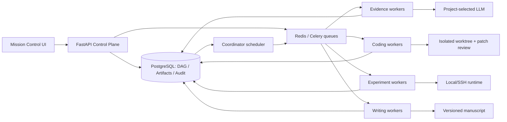
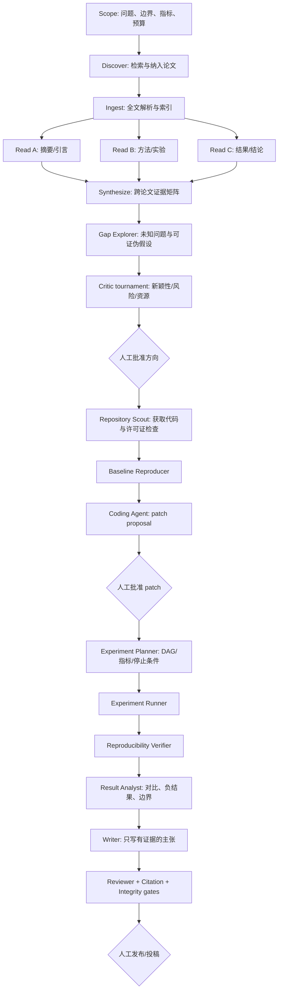

# ResearchOS Agent Army 架构决策

状态：Accepted for incremental implementation
日期：2026-08-15
适用范围：论文发现、结构化阅读、未知方向探索、代码实现、实验、写作、审稿与发布

## 1. 结论

ResearchOS 不应做成一群 Agent 互相自由聊天、递归创建下级 Agent 的“蜂群”。选定架构是：

1. 一个持久化 Coordinator 负责 DAG、预算、权限、租约、重试和人工闸门；
2. 专项 Agent 只消费版本化输入并产出结构化 Artifact；
3. Agent 之间不直接改变任务状态，只通过 Handoff Envelope 向 Coordinator 交付；
4. 所有关键结论必须绑定论文片段、代码提交、实验 Run 或人工决策；
5. 代码和论文修改先形成可审查提案，禁止 Agent 直接覆盖共享主线；
6. 控制面继续使用模块化单体，执行面使用分队列 Worker，不提前拆微服务。

这套设计优先保证可恢复、可审计、可复现和可人工接管，而不是追求 Agent 数量。

## 2. 当前系统审查

### 已经可用

| 能力 | 当前实现 | 结论 |
|---|---|---|
| Mission | 五阶段持久化状态机、版本冲突、人工批准 | 可作为人机工作流外壳 |
| 论文 | arXiv 导入、分节、chunk、混合 RAG、引用定位 | 可作为 Evidence Agent 数据面 |
| 阅读卡 | 结构化 Agent、逐字 quote 校验、版本历史 | 可作为单论文分析 Artifact |
| 综述 | 章节级 Agent、引用和 claim 校验 | 可作为 Synthesis Agent 原型 |
| Idea/Critic | Idea、批判结果和文献引用 | 可作为方向候选评审原型 |
| Coding | Workspace 工具、Patch Proposal、人工 apply | 安全边界正确，可继续扩展 |
| 实验 | Plan、Run、Metric、Log、Artifact | 数据模型基本具备，缺调度闭环 |
| 写作 | LaTeX 文档、选择编辑、Reviewer、Release | 能力存在，尚未由统一 DAG 驱动 |
| LLM | 项目级配置、编辑、连接测试、按 Run 选模型 | 本轮已修复部分更新语义 |

### 核心缺口

1. `MissionStep` 是固定线性流程，不是可并行、可重试的任务 DAG。
2. `AgentRun` 只有 queued/running/terminal，缺 lease、heartbeat、attempt 和 checkpoint。
3. Agent 输出直接进入各领域表，但缺统一 Artifact 注册、输入哈希和 lineage。
4. Prompt、模型、技能和工具权限没有形成一次运行的不可变版本快照。
5. 论文阅读范围过去由 Agent 自行决定，实验设置、结果、结论没有独立结构字段。
6. GitHub 获取、许可证检查、基线复现、代码修改和实验结果之间没有强制依赖。
7. WebSocket 主要服务单 Run 展示，还不能展示任务图、闸门和跨 Agent handoff。

## 3. 被否决的方案

### 自由蜂群

每个 Agent 可以自由创建 Agent、互相发自然语言消息。否决原因：任务爆炸、预算不可控、
权限扩张、重复执行、无法判断谁对最终产物负责。

### 单一超级 Agent

一个长 Prompt 完成文献、代码、实验和论文。否决原因：上下文污染、恢复粒度过大、错误难以
归因，且代码执行与论文论证需要完全不同的权限。

### 立即微服务化

每个 Agent 独立服务和数据库。否决原因：当前规模没有独立扩缩容证据，却会立即引入分布式
事务、跨服务授权和契约部署成本。

## 4. 选定运行架构



Coordinator 不是生成内容的 Agent。它只负责：

- 将用户批准的目标实例化为 DAG；
- 校验依赖 Artifact、权限、预算和策略；
- 租赁就绪任务并分派到队列；
- 消费结果、验证 acceptance、解锁下游；
- 在失败、超预算、无进展或需要人工决策时暂停；
- 记录所有状态变化和人工决定。

## 5. 端到端研究链路



关键规则：方向批准前不下载和执行任意仓库；代码批准前不进入共享分支；实验结果没有
commit、数据版本、配置、seed 和原始指标时不能进入论文主张。

## 6. Agent 职责

| 角色 | 唯一主责产物 | 关键输入 | 禁止行为 |
|---|---|---|---|
| Evidence Scout | 候选论文集 | Scope、检索策略 | 把搜索摘要当全文结论 |
| Paper Reader | ReadingCard | 选定 section kinds、原文 | 使用未提供章节或外部事实 |
| Synthesizer | EvidenceMatrix | 已复核 ReadingCard | 逐篇拼接代替跨文献比较 |
| Gap Explorer | DirectionCandidate | EvidenceMatrix、冲突与空白 | 把空白直接宣称为创新 |
| Critic | DirectionReview | 候选方向、近邻工作 | 自行批准方向 |
| Repository Scout | RepositorySnapshot | 批准方向、论文代码链接 | 执行未知脚本或泄露密钥 |
| Coding | PatchProposal | 锁定 commit、任务验收条件 | 直接写共享主线 |
| Experiment Planner | ExperimentDAG | 假设、基线、资源 | 生成或猜测实验结果 |
| Experiment Runner | ExperimentRun Artifact | 锁定代码/数据/配置 | 修改论文结论 |
| Reproducibility | VerificationReport | Run、环境、原始 Artifact | 隐藏失败或只挑最好 seed |
| Result Analyst | ClaimCandidate | 已验证结果 | 把相关性写成因果性 |
| Writer | ManuscriptRevision | ClaimCandidate、引用锚点 | 写入无来源数字或引用 |
| Reviewer | ReviewReport | 稿件、证据图、venue rubric | 直接覆盖稿件 |
| Release | ReleaseCandidate | 通过全部 gate 的版本 | 未经批准发布或投稿 |

## 7. Artifact-first 协议

Agent 之间不传任意聊天记录作为事实，而传结构化 envelope：

```json
{
  "protocol": "researchos.handoff/v1",
  "mission_id": "uuid",
  "task_id": "uuid",
  "attempt": 2,
  "sender_role": "paper-reader",
  "recipient_role": "synthesizer",
  "idempotency_key": "mission/task/attempt/output",
  "inputs": [{"artifact_id": "uuid", "version": 3, "sha256": "..."}],
  "outputs": [{"artifact_id": "uuid", "schema": "reading-card/v2", "sha256": "..."}],
  "claims": [{"claim_id": "uuid", "evidence": ["paper-section:uuid"]}],
  "acceptance": ["selected_sections_only", "quotes_verified"],
  "status": "artifact_ready",
  "error": null
}
```

每个 Artifact 至少记录：`schema_name`、`schema_version`、`content_hash`、`producer_run_id`、
`input_artifact_versions`、`created_by`、`visibility` 和 `supersedes_id`。

## 8. Durable DAG 数据模型

下一阶段新增以下表，不复用 `AgentRun` 冒充任务：

| 表 | 用途 |
|---|---|
| `mission_tasks` | DAG 节点、role、状态、attempt、预算、acceptance |
| `mission_task_dependencies` | 节点依赖和所需 Artifact schema |
| `task_leases` | lease owner、到期、heartbeat，保证崩溃恢复 |
| `artifacts` | 统一产物注册、hash、schema、lineage |
| `artifact_links` | claim/evidence/code/run/manuscript 关系 |
| `approval_gates` | scope、direction、patch、compute、claim、release |
| `prompt_revisions` | role prompt、tool policy、model policy 的不可变版本 |
| `task_events` | append-only 状态与审计事件 |

`MissionStep` 继续作为用户看到的阶段聚合；`mission_tasks` 是阶段内部的执行 DAG。两者不可
合并，否则 UI 状态与执行重试会互相污染。

## 9. 状态、租约与停止条件

任务状态：

```text
draft -> ready -> leased -> running -> artifact_ready -> verifying -> completed
                           |                  |
                           +-> retryable_failed -> ready
                           +-> waiting_approval
                           +-> terminal_failed
any non-terminal -> cancelled
```

所有副作用必须使用 idempotency key。Worker 只能在持有有效 lease 时提交结果。Coordinator
在以下情况停止：DAG 完成、重复失败达到上限、连续两轮无新 Artifact、预算达到 90%、证据或
完整性 gate 失败、用户暂停或取消。

## 10. 模型与上下文策略

- 模型配置属于项目，但每个 Task 固定 `llm_config_id + model + prompt_revision` 快照；
- Coordinator 可按任务选择模型策略，不能在执行中静默换模型；
- 论文 Reader 的上下文由 section allowlist 构建，不把整库塞入 Prompt；
- Synthesizer 读取已复核 ReadingCard 和按需证据片段，不重复吞全文；
- Coding Agent 读取 repo map、目标文件和邻近测试，不读取无关论文全文；
- Writer 只消费已批准 claim 和 Artifact link；
- 超长上下文通过 Artifact 摘要分层，而不是无损压缩所有历史对话。

## 11. 安全与人工闸门

必须人工批准：研究方向、第三方仓库获取、许可证冲突处理、首次 SSH、付费/大规模算力、
Patch apply、主指标选择、结论升级、主分支合并、公开发布和投稿。

自动执行允许范围：只读检索、已批准论文解析、离线结构化提取、静态检查、隔离工作树中的
测试、已批准实验矩阵内的重试、格式化和不改变论证的文档构建。

## 12. 分阶段实施

### P0：当前修复

- LLM 配置可创建、编辑、测试、删除和按 Run 选择；
- PATCH 省略字段不会重置配置；
- 论文删除有完整引用预检；
- 论文读取范围可选，实验设置、关键结果和结论进入版本化 ReadingCard；
- 方向进入 active 前必须有 Critic 结果，且每个项目只能批准一个当前方向；
- 已批准方向可显式导入 GitHub 固定快照：严格 URL、commit、license、submodule、
  manifest、文件/体积上限和 Git 审计提交均已落地；
- RepositorySnapshot 可创建专属 Coding Session，Coding Agent 仍只生成待人工批准的 Patch；
- SSH Profile 存在执行历史时禁止删除，避免级联清空远程运行审计；
- 前后端 Agent 类型契约同步。

### P1：Evidence vertical slice

- 批量生成 ReadingCard，按论文并行；
- EvidenceMatrix 聚合方法、数据、指标、结果、局限和相互冲突；
- Gap Explorer 只从矩阵中的冲突、未覆盖组合和失败边界产生候选；
- 方向候选必须经过 Critic 和人工批准。

### P2：Durable orchestration

- 已实现 `mission_tasks`、dependency、lease/heartbeat、hashed artifact、gate 和 append-only
  task event，Alembic `0024` 固化数据库约束；
- 已实现 17 节点标准科研 DAG、无环校验、`FOR UPDATE SKIP LOCKED` Worker 领取、租约
  过期回收、重试上限、项目/任务幂等键和 Mission 暂停保护；
- AgentRun 通过 `mission_task_id` 与 Task 绑定，成功、失败、取消会在同一事务中自动回写
  Artifact、Task 状态并解锁下游，Coordinator tick 作为恢复路径；
- Mission Control 已展示真实 DAG、依赖、attempt、Run、Artifact、Gate 和 Task Event；
- 待后续补齐：独立 Scheduler/Beat、统一 PromptRevision 注册表、跨域 ArtifactLink 与实际
  token/GPU 预算扣减。

### P3：Repository to experiment

- Repository Scout 的首个纵向切片已实现：仅下载批准的 GitHub HTTPS 仓库，记录 URL、
  commit、license、submodule、manifest 和工作区 Git commit；排除 `.git`、敏感路径、
  symlink 与 submodule 内容，不运行仓库代码；
- 已实现 RepositorySnapshot -> Coding Session -> Coding Agent -> PatchProposal 的交接；
- 每个任务使用隔离 worktree；
- Coding 输出 PatchProposal，验证后人工 apply；
- Experiment Planner 输出不可变 DAG，Runner 记录原始指标，Verifier 重跑关键结果。

### P4：Evidence-bound writing

- Claim Registry 连接论文 section、代码 commit、实验 run 和文稿位置；
- Writer 只消费批准 claim；
- Reviewer、Citation、Integrity gate 阻断无来源数字和过期结果；
- Release Candidate 经人工确认后才发布。

## 13. 验收标准

平台达到“Agent Army 可用”至少需要：

1. 服务重启后 DAG 能从数据库恢复且不重复副作用；
2. 同一任务重复投递只产生一个有效 Artifact；
3. 任意论文结论可定位到 section 和逐字 quote；
4. 任意实验数字可定位到 commit、数据版本、配置、seed 和原始 metric；
5. 任意代码变更先显示 diff 和测试，再由人批准进入共享分支；
6. 任意文稿主张可追踪到论文或实验 Artifact；
7. 模型、Prompt、Skill、Tool 版本可从 Run 完整复盘；
8. 预算耗尽、连续失败、证据不足和用户暂停均能确定性停止。
