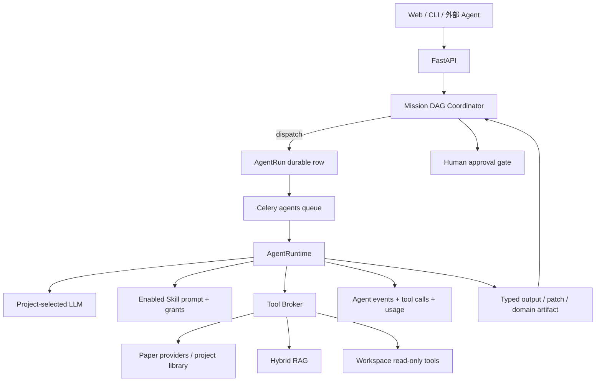
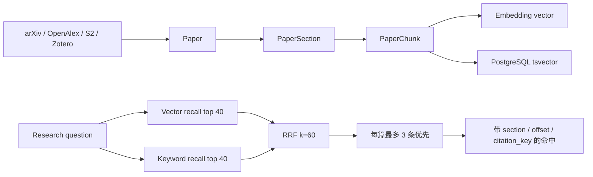

# ResearchOS 当前 Agent 链路与 RAG 数据流

> 本文描述当前代码已经实现的链路，不把规划中的能力写成已上线能力。关键实现入口均附路径，便于后续修改 Agent 编排。

## 1. 两层编排

ResearchOS 当前有两层相互独立但可以衔接的编排机制：

1. **Mission DAG（跨阶段）**：负责研究任务顺序、审批门、重试、租约和成果哈希。
2. **Agent Runtime（单次运行）**：负责模型选择、Skill 注入、工具循环、结构化输出、引用白名单和事件流。



### 1.1 Mission DAG

定义位置：`apps/api/researchos/orchestration/service.py`

当前标准任务链升级为 26 个有效节点，核心路径为：

```text
scope → discover → read/tuple-RAG → synthesize
→ idea_rank + benchmark → critic → direction
→ repository → baseline + coding → code_check
→ pilot → pilot_review → leader
→ experiment_plan → experiment_run → progress → reproduce → analyze
→ writer_outline → writer_results → drawer + citation → review → release
```

Leader 根据 Viewer Artifact 在 `revise_code / continue_pilot / try_direction / scale_experiments / write / stop` 之间路由；Writer outline 在方向确定后即可与代码/实验并行。完整协议见 [长程多 Agent 科研闭环](AUTONOMOUS_RESEARCH_PROGRAM_ZH.md)。

其中 `baseline` 与 `coding` 都完成后，`experiment_plan` 才会解锁。DAG 会拒绝环路；任务状态、依赖、事件、成果和审批门均持久化在 PostgreSQL。

### 1.2 审批门

当前硬审批点：

| 任务 | 审批时机 | 条件 |
|---|---|---|
| `scope` | 执行前 | 用户确认研究范围 |
| `direction` | 执行前 | 用户确认一个经过 Critic 的方向 |
| `repository` | 执行前 | 已存在可追踪的仓库快照 |
| `coding` | 执行后 | Patch 已在 AI IDE 中审查并应用 |
| `experiment_run` | 执行前 | 计算资源审批；当前配置允许非强制 |
| `release` | 执行后 | 用户确认最终发布候选 |

任务失败后按 `max_attempts` 进入可重试或终止失败；外部执行器可通过 lease/heartbeat/submit 接口领取任务，过期租约会被 Coordinator 回收。

## 2. 单次 Agent Runtime

实现位置：

- `apps/api/researchos/agents/runtime/runtime.py`
- `apps/api/researchos/agents/runtime/base.py`
- `apps/api/researchos/agents/runtime/tools.py`
- `apps/api/researchos/agents/runtime/skills_injection.py`

执行顺序：

1. API 创建 `AgentRun(status=queued)` 并提交到 Celery `agents` 队列。
2. Worker 读取持久化运行记录。
3. 按 `context.llm_config_id` 选择指定模型；没有指定时使用项目最近更新的启用配置。
4. 读取该项目已启用且模块匹配的 Skills。
5. 把 Skill prompt、工作流文字和允许的工具授权注入 system prompt。
6. Agent 声明自身工具；Runtime 计算“Agent 工具 ∪ Skill 授权工具 ∩ 平台注册表”。
7. 模型流式返回文字或工具调用。
8. Tool Broker 校验权限、记录参数和结果、发 WebSocket 事件，并把工具结果返回模型。
9. 达到工具预算后强制进入最终综合；结构化 Agent 还会执行 schema 校验和一次自修复。
10. 输出、引用、token usage、错误和结束状态持久化；如果来自 Mission DAG，则原子回填对应任务。

### 2.1 当前 Agent 与数据边界

| Agent | 主要输入 | 工具或证据来源 | 输出 |
|---|---|---|---|
| Research | 用户问题、可选论文 section | Hybrid RAG、外部论文搜索、库列表、论文 sections | 带引用白名单的综合文本 |
| Critic | 已保存 Idea | 项目论文库列表 | 结构化新颖性与可行性评审 |
| Reading Card | Mission + 论文 + section 类型 | 数据库中已解析的精确 sections | 版本化阅读卡 |
| Review Section | Review 文档和选中证据 | 数据库中已选论文段落 | 可审核的综述段落与逐条引用 |
| Experiment Planner | Review、Mission papers、精确 sections | 数据库确定性查询 | Baseline、变量、消融和复现计划 |
| Coding | 用户要求、工作区 | tree/read/grep；必须先读后改 | Patch Proposal，不直接写文件 |
| Experiment | 实验记录 | 已持久化运行和指标 | 结果分析文本 |
| SQL Analyst | 已注册数据集 | 只读 SQL 沙箱 | SQL 结果和解释 |
| Citation Organizer | Mission papers | 确定性元数据检查 | 去重、缺失项和 BibTeX |
| LaTeX | 论文内容或选区 | 文档版本、选区和用户指令 | 建议或写作文本，不绕过 CAS |

## 3. RAG 在哪里使用

### 3.1 摄取与索引



实现位置：

- 分块与增量索引：`researchos/knowledge/indexing.py`
- Embedding profile：`researchos/knowledge/profiles.py`
- Embedding 实现：`researchos/knowledge/embeddings.py`
- Hybrid RAG：`researchos/knowledge/service.py::rag_search`
- API：`POST /projects/{project_id}/knowledge/rag-search`
- Agent 工具：`knowledge.rag_search`

当前检索策略：

- Paper chunk 与 ReadingCard 多元组共同进入 `hybrid-vector-keyword-tuples-v3`。
- 每个向量/关键词分支最多召回 40 个候选。
- 向量分支使用 pgvector cosine distance。
- 关键词分支使用 PostgreSQL `ts_rank` 与 OR tsquery。
- 两路用 Reciprocal Rank Fusion，`k=60`。
- 默认优先限制每篇论文最多 3 个命中，数量不足时再补齐。
- 返回 `paper_id`、`section_id`、字符区间、向量分、关键词分、命中原因和 `citation_key`。
- Research Agent 现在优先调用项目 RAG，再按需外部搜索。

### 3.2 不经过 RAG 的精确证据路径

以下链路故意不使用相似度检索：

- 用户在阅读器中选择具体 section 后“解释本节”：直接注入指定 `PaperSection`。
- Reading Card：按论文和 section 类型确定性读取。
- Review Section：使用用户纳入综述的精确来源段落。
- Experiment Planner：使用 Mission 已纳入论文及其精确段落。
- Citation Organizer：检查规范化论文元数据，不调用模型检索。
- 实验结果：来自 `ExperimentRun` / `ExperimentMetric`，不通过文本 RAG 猜测。

这样可以避免在已知精确来源时引入相似度检索的漂移。

## 4. 引用完整性

Tool Broker 只把工具实际返回的论文加入 `citation_whitelist`。Agent 最终输出中的引用会与该白名单比对；未检索到的 citation key 不会进入已验证引用列表。RAG 命中同样携带 canonical `source:external_id`，因此进入同一白名单机制。

这不是完整的事实正确性证明，但可以阻止模型把未经过工具或用户指定来源的论文伪装成已检索引用。

## 5. 受控研究循环

实现位置：`researchos/orchestration/research_loop_service.py` 与 `loop_policy.py`。

研究循环位于 `experiment_run` 节点内部：

```text
baseline
  → 提出一次只修改 editable scopes 的候选
  → Patch / Git commit / ExperimentRun 绑定
  → 读取目标 metric
  → 规则检查 + Critic threshold + complexity budget
  → keep 或 discard
  → 达到 max_iterations 或 patience 后停止
```

受保护路径不可修改；候选必须记录 Git commit；失败/取消实验计为 crashed，不得成为最佳结果。

## 6. 成果发布子链路

Release Studio 现在有两条发布链：

### README

```text
Research Story Pack
  → Coding Agent(qwen-plus)
  → workspace tree/read/grep
  → README.md Patch Proposal
  → 用户审查并应用
  → Git commit（工作区启用 Git 时）
```

### Poster / Slides / Website

```text
Research Story Pack
  → ResearchOS ReleaseJob
  → AutoDesign /api/generate
  → qwen-plus text-agent roles
  → DesignHarness ingest / author / validate / export
  → integrations/AutoDesign/out/runs/<run_id>/final
  → ResearchOS 展示预览、下载与质量诊断
```

ResearchOS 仅把解密后的 API key 放入 AutoDesign 启动请求头，不将密钥写入 ReleaseJob。持久化记录保存模型名、外部 run id、状态、输出目录和成果 URL。

## 7. 当前边界与后续修改建议

1. Mission DAG 是固定模板，不是由 Planner 动态生成；若要动态编排，应先增加可验证的 DAG schema 和预算策略。
2. `gap`、`analyze`、`review` 当前复用 Research Agent；如果需要不同评审标准，应拆成独立 Agent 类。
3. AutoDesign 是独立服务与子模块，不与 ResearchOS Worker 进程混装，避免把 Playwright、视频和视觉依赖塞入核心 API。
4. RAG 已索引论文 chunks 和 ReadingCard 的 idea/benchmark/ablation/code/result tuples；代码正文、实验日志和用户笔记尚未进入统一向量索引。
5. RAG 引用 URL 在当前工具转换中可能为空，但 canonical citation key、论文 ID 和 section ID 均保留；后续可通过 Paper 表补全 URL。
6. 模型级长耗时任务继续使用 Celery/AutoDesign 后台运行；HTTP 请求只负责创建 durable handle，不应等待整个生成流程。
