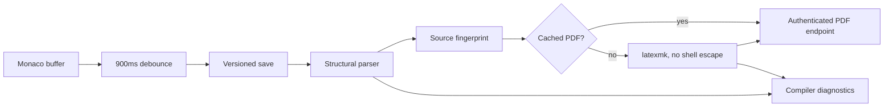

# ResearchOS LaTeX Pipeline

## 1. Current user experience

The Paper workspace stores a real multi-file LaTeX project (`main.tex`, bibliography files, and generated anchor files), edits the main file in Monaco, and shows either a compiled PDF or a structural preview in the right rail.

When **实时 PDF** is enabled:

1. The editor waits 900 ms after the latest edit.
2. The current buffer is saved with compare-and-swap version protection.
3. The saved snapshot is compiled.
4. A successful PDF replaces the previous preview automatically.
5. Diagnostics remain clickable and jump to the source line.

The manual Compile button saves a dirty buffer before compiling, so it never knowingly compiles an older server version.

## 2. Compile flow



Backend implementation:

- API routes: `apps/api/researchos/documents/router.py`
- Versioned document service: `apps/api/researchos/documents/service.py`
- Bounded compiler: `apps/api/researchos/documents/latex_compiler.py`
- Structural parser: `apps/api/researchos/documents/latex_parse.py`
- PDF UI: `apps/web/features/paper/PreviewPanel.tsx`

## 3. Real compiler and fallback

The LaTeX-enabled Docker image installs `latexmk` and TeX Live packages for article, IEEE, ACM, Elsevier, and common poster sources.

Compilation uses an argv list rather than a shell and passes:

```text
-pdf
-interaction=nonstopmode
-halt-on-error
-file-line-error
-no-shell-escape
```

Additional controls:

- relative project paths only
- new temporary workspace for each compile
- 30-second default timeout
- bounded compiler log
- restricted TeX input/output settings
- final PDF copied only to the configured artifact root
- authenticated PDF download route
- project authorization checked before every PDF response

If `latexmk` is not installed, ResearchOS keeps the structural preview and diagnostics. The response engine remains `mock` for backward compatibility; no PDF URL is claimed.

## 4. Cache behavior

A SHA-256 fingerprint covers the main-file path and every stored LaTeX file path/content pair. A successful identical fingerprint reuses the existing PDF and records a new compile job with an engine suffix of `-cache`.

This makes reopen and repeated Compile clicks inexpensive while retaining an auditable job history.

## 5. Storage

PDF files are stored under:

```text
${ARTIFACT_ROOT}/latex/<project_id>/<compile_job_id>.pdf
```

Docker Compose mounts `/data/artifacts` as the `artifactdata` volume. The database stores the internal path, byte size, source fingerprint, engine, duration, diagnostics, and compile log. The browser receives only an authenticated API URL.

## 6. Version safety

All writes go through `write_file_versioned`:

- `expected_version` is compared with the current file version.
- Each accepted write creates an immutable `DocumentFileRevision`.
- Conflicts return `document_version_conflict`.
- The frontend opens a merge dialog instead of silently replacing user text.
- Local drafts protect unsaved text from a browser refresh.

## 7. Citations and experiment assets

- Citation insertion uses canonical project papers and updates the bibliography through the same versioned write path.
- Result anchors materialize verified experiment values into versioned LaTeX files.
- The LaTeX Agent can propose selected-text changes, but user acceptance performs the actual versioned mutation.
- Claims and citations must remain traceable to project papers, experiment records, or explicit user assumptions.

## 8. Production hardening path

The current compiler is bounded and shell escape is disabled, but a public multi-tenant deployment should move TeX into a dedicated worker sandbox with:

- separate unprivileged user or microVM/container
- no network namespace
- CPU, memory, process, and file-size limits
- cancellation of superseded snapshots
- artifact retention policy and malware scanning

The API contract and PDF endpoint do not need to change when this execution step moves to a dedicated worker.
