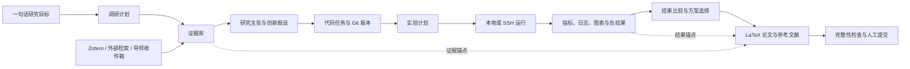

# ResearchOS 一体化科研工作台：产品与工程蓝图

> 项目所有者：Chenxxxxxx06
> 目标：用户输入一句研究目标，系统在人工检查点约束下完成调研、实现、实验、比较与论文交付。

老师《科学文献研究智能体：从综述到实验设计》中的任务与设计要求，已在
[老师要求对齐与增量产品设计](TEACHER_REQUIREMENTS_INCREMENTAL_PRODUCT_DESIGN_ZH.md)
中展开，并在[老师要求逐项验收矩阵](TEACHER_REQUIREMENTS_ACCEPTANCE_MATRIX_ZH.md)
中按“要求—页面—操作—数据—复跑证据”标记最终交付；本文继续作为全局产品与工程蓝图。

## 1. 产品不是九个孤岛

所有页面必须读写同一组可追溯实体：



核心约束是：论文中的结论必须能回指论文证据或实验运行；实验必须能回指代码
commit、环境和数据版本；自动化不得绕过费用、外部执行和投稿前的人工确认。

## 2. 九项需求的落地拆解

| 需求 | 当前落地 | 下一层工程化 |
|---|---|---|
| Zotero 与论文推送 | 项目级 Zotero 配置、真实连通测试、增量同步、DOI 去重关联、个性化 feed、独立文献中心 | API key 加密、定时同步、collection 精确过滤、向量重排、邮件/站内推送 |
| Research Copilot 不可用 | 设置页增加真实最小生成测试，返回延迟、样例、token 与可操作错误 | Provider 能力探测、模型列表同步、代理与证书诊断、配额监控 |
| 创新点提取 | 阅读室一键进入专用提取模板，强制输出证据、贡献、局限、复现、baseline、benchmark、ablation 和后续方向 | 将提取结果结构化保存为 Claim / Evidence / Idea，而非只留在聊天 |
| AI IDE | 已有真实工作区读取、搜索、新建与 CAS 保存、Monaco、补丁审阅、真实 Git 状态/历史/提交/回退和编码 Agent | SSH profile + 主机指纹确认 + secret vault；PTY 会话；资源管理器移动/删除；多 Agent 链路 |
| 实验面板 | 所有运行展示真实进度与当前步骤；增加“文献→假设→代码→实验→比较→论文”数据链路视图 | ExperimentPlan、baseline/benchmark/ablation 结构表；调度器；多机资源；自动结果表与 Pareto 选择 |
| 论文工作区 | 移除技能市场与技能构建器入口；提供 article / IEEE / ACM / Elsevier 模板，创建 main.tex 和 references.bib | 真 LaTeX 编译容器、模板上传、编译缓存、协同编辑 |
| 参考文献专区 | 新增“文献中心”，统一 Zotero 库、项目论文库和个性化推荐 | 引文网络、重复文献合并、BibTeX 清洗、引用覆盖率检查 |
| 一句话完整闭环 | 本文定义持久化状态机与检查点；现有 Agent/实验/论文实体已具备接入基础 | 新增 ResearchMission 编排器、补偿/重试、预算、暂停恢复、证据门控与最终打包 |
| 导师/师兄消息与录音 | Research Inbox 已持久化消息、笔记、文本文件和录音转写稿，并关联真实 Agent run 提取方向、约束、待办与文献线索 | PDF/Office 解析、原始音频存储与转写适配器、来源权限与保留策略 |

## 3. Research Mission 状态机

一句话入口不应直接触发一个超长 Agent，而应创建可暂停、可恢复、可审计的
`ResearchMission`。每个状态节点有输入、输出、完成条件和失败补偿：

1. `scoping`：澄清问题、领域、预算、算力、时间和成功指标。
2. `researching`：Zotero-first 检索，再做外部检索验证时效性与覆盖率。
3. `synthesizing`：按问题、方法、结果、局限抽取，形成 evidence graph。
4. `hypothesizing`：形成可证伪主张与创新候选，区分事实和推断。
5. `planning`：生成代码任务、数据集、baseline、benchmark 和实验矩阵。
6. `implementing`：编码 Agent 产出补丁，经审阅后形成 Git commit。
7. `running`：本地或 SSH 执行；持续回传进度、日志、资源和中间指标。
8. `analyzing`：统计比较、误差分析、消融、失败案例和负结果。
9. `selecting`：按预先定义的主指标、成本和稳健性做 Pareto 选择。
10. `writing`：生成带 Evidence/Result Anchor 的 LaTeX、图表和 BibTeX。
11. `integrity_check`：检查引用、数字、图表来源、泄漏、复现材料与作者声明。
12. `ready_for_review`：交给用户审核；系统不得自行投稿。

建议将下列状态作为不可跳过的人工检查点：

- 范围与预算确认；
- 外部代码执行和 SSH 主机首次信任；
- 大规模/付费实验启动；
- 最优方案选择；
- 最终论文、作者与投稿确认。

## 4. 实验规划的数据模型

`ExperimentPlan` 应至少包含：

```text
claim_id
dataset_versions[]
primary_metric
secondary_metrics[]
baselines[{paper_id, repository, expected_result, rationale}]
benchmarks[{dataset, protocol, split, leakage_checks}]
ablations[{component, what_it_tests, expected_if_matters, priority, estimated_cost}]
runs[{config, seed, code_commit, environment_digest, executor}]
decision_rule
budget
```

顺序上先做“组件消融”，再做“超参数敏感性”；只有当论文主张已经被主实验支持后，
才扩大消融矩阵。每个消融必须记录 `what_it_tests` 和
`expected_if_matters`，失败或负结果同样进入结果库，避免只汇报有利结果。

数据链路可视化需要同时显示：

- 数据输入：样本数、类别/长度分布、缺失值、泄漏检查、预处理前后示例；
- 执行状态：排队、运行主机、当前步骤、进度、ETA、GPU/CPU/内存；
- 输出比较：置信区间、seed 方差、成本、速度、显存、失败案例；
- 论文映射：哪个表格/图/数字引用了哪个 run 和 artifact。

## 5. SSH 与终端的安全边界

SSH 不能只保存一串密码。建议实现：

- `ComputeProfile` 仅存 host、port、user、workspace、认证方式和 secret reference；
- 私钥/密码进入 secret vault，不写数据库明文、不回传浏览器；
- 首次连接展示 host-key fingerprint，用户确认后固定；
- 默认禁用 agent forwarding、端口转发和任意本地路径挂载；
- 每条命令记录发起者、mission、cwd、退出码和时间，但对 secret 做脱敏；
- 浏览器终端通过受限 PTY 会话连接，带超时、并发和资源限制；
- 编码 Agent 只能提交补丁；执行 Agent 使用显式批准过的命令计划。

本地执行与 SSH 执行应实现同一个 `Executor` 接口：

```text
prepare(workspace, commit, environment)
run(command, resources)
stream_logs()
collect_metrics()
collect_artifacts()
cancel()
cleanup()
```

## 6. Research Inbox

导师消息、录音和文件进入同一收件箱，每条记录保留来源、发送者、时间和原文件哈希。
处理链为：

```text
原始输入 → 转写/解析 → 来源保真的分段 → 摘要 → 方向/约束/待办/文献线索
        → 用户确认 → 转成 ResearchMission / Idea / Paper / Task
```

音频转写必须是可替换适配器，不能把“上传成功”冒充“已理解音频”。原始文件、转写文本、
模型摘要和用户修改稿分别版本化。

## 7. 交付优先级

### P0：已进入当前代码

- LLM 真实连通测试；
- Zotero 配置、测试、同步、文献中心与 feed 个性化；
- 论文创新点提取入口；
- 实验 run 进度与数据链路总览；
- 四种 LaTeX 投稿模板；
- Research Inbox 与方向提取；
- 移除技能市场/构建器前端；
- 专有版权与所有权声明。

### P1：下一迭代

- ResearchMission 与 ExperimentPlan 持久化状态机；
- Zotero key/LLM key secret vault；
- Research Inbox 文本、PDF、Office 文件解析；
- SSH profile、主机指纹与连通测试；
- IDE 移动/删除文件；
- 实验矩阵和自动对比报告。

### P2：受基础设施约束

- WebSocket PTY 终端和远程文件系统；
- GPU 调度、失败恢复与跨机 artifact 存储；
- 音频转写；
- 真 LaTeX 容器编译；
- 端到端自动研究链路及预算治理。

## 8. 完成标准

“一体化完成”不是页面都能点开，而是一次 mission 可以在重启后恢复，任何论文数字均可
追溯到 run，任何 run 均可追溯到 commit、数据与环境，任何外部执行均有授权记录，最终
压缩包能包含 PDF、TeX、BibTeX、图、结果表、运行清单和复现实验说明。
